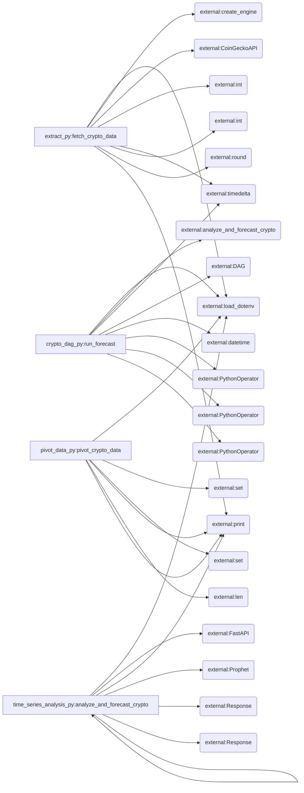

# Crypto Price Data Pipeline and Forecasting

## Project Overview
This project builds an end-to-end data pipeline for collecting, processing, and forecasting cryptocurrency prices. It leverages Apache Airflow, Apache Spark, Pandas, Docker, and Prophet for data extraction, transformation, and time series analysis.

## Architecture Overview

```
repoht4re_o8
├── README.md
├── extract.py
├── crypto_dag.py
├── time_series_analysis.py
├── .gitignore
└── pivot_data.py
```

The project consists of several Python scripts and a README file. `extract.py` retrieves cryptocurrency price data from the CoinGecko API. `pivot_data.py` transforms the extracted data. `time_series_analysis.py` performs time series analysis and forecasting using the Prophet library. `crypto_dag.py` defines the Apache Airflow DAG to orchestrate the pipeline.

## Key Modules and Functions

- **File:** `extract.py`
  - Functions:
    - `fetch_crypto_data`: Retrieves cryptocurrency price data from the CoinGecko API. **(entry point)**

- **File:** `crypto_dag.py`
  - Functions:
    - `run_forecast`: Defines the Apache Airflow DAG to orchestrate the data pipeline. **(entry point)**

- **File:** `time_series_analysis.py`
  - Functions:
    - `analyze_and_forecast_crypto`: Analyzes and forecasts cryptocurrency prices using the Prophet library. **(entry point)**
    - `get_forecast`: Retrieves the forecast data.

- **File:** `pivot_data.py`
  - Functions:
    - `pivot_crypto_data`: Transforms the extracted data. **(entry point)**

## Data Flow or Call Graph



The data flow starts with `extract.py` fetching data, then `pivot_data.py` transforms it. `time_series_analysis.py` analyzes the data and creates a forecast. `crypto_dag.py` orchestrates these steps using Airflow.

## Usage Instructions

To set up and run the project:
1. Install dependencies.
2. Configure Airflow.
3. Run the DAG.

_Generated automatically by CodeGenius AI_